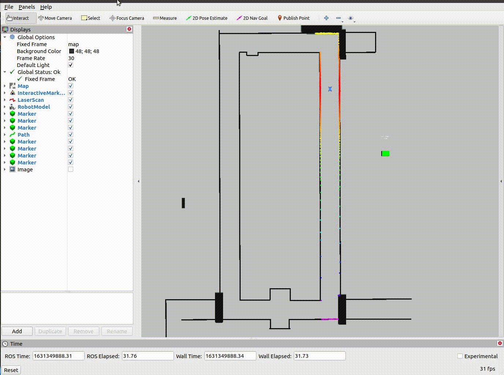

# F1Tenth-Lab4 & Race 1 (Follow the Gap)
This is a repo for F1Tenth Lab 4 Assignment and Race 1 which implements reactive methods or Follow The Gap Algorithm for object avoidance.

## Dependeices for Running Locally
* ROS Melodic / ROS Noetic
    * Ubuntu [click here for installation instructions](http://wiki.ros.org/melodic/Installation/Ubuntu)
* F1TENTH Simulator
    * [click here for installation instructions](https://f1tenth.readthedocs.io/en/stable/going_forward/simulator/index.html)

## Basic Run Instructions

1. Clone this repo into catkin_ws/src.
2. Change the map to 'levine_blocked.yaml' in f1tenth_simulator/launch/simulator.launch (line 7)
3. Launch it: `roslaunch reactive_methods reactive_gap_follow.launch`.
4. Press 'N' key to activate navigation mode in the running terminal.
5. Output Example:

## Issues and Aspects to be improve

1. The extending disparities method does not works as desired, added tolerance to make it works, further investigation is needed for the disparities implementation.
2. This reactive method requires high computing power, in other words, a good CPU and GPU is needed for the autonomous racing work properly. (Some laptops need to be in charging mode for maximum performance)